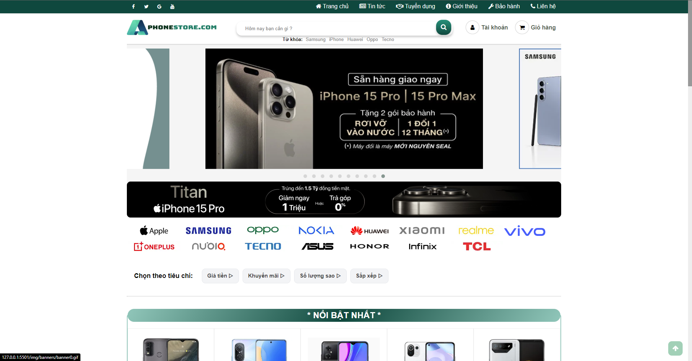
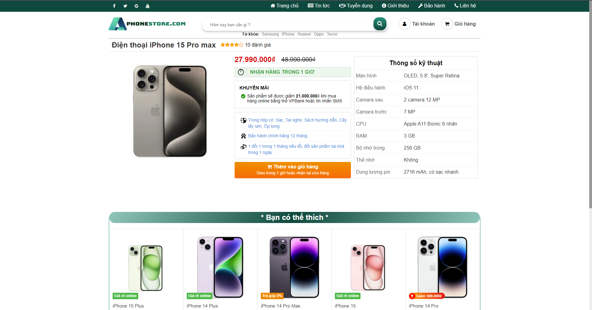
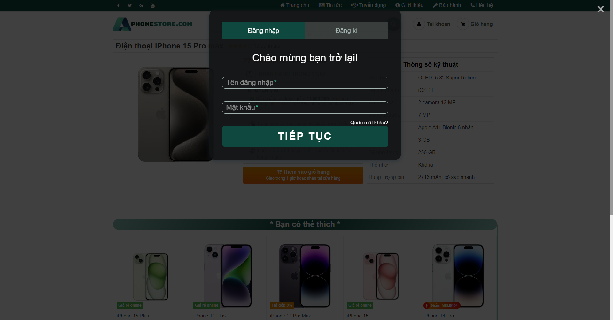
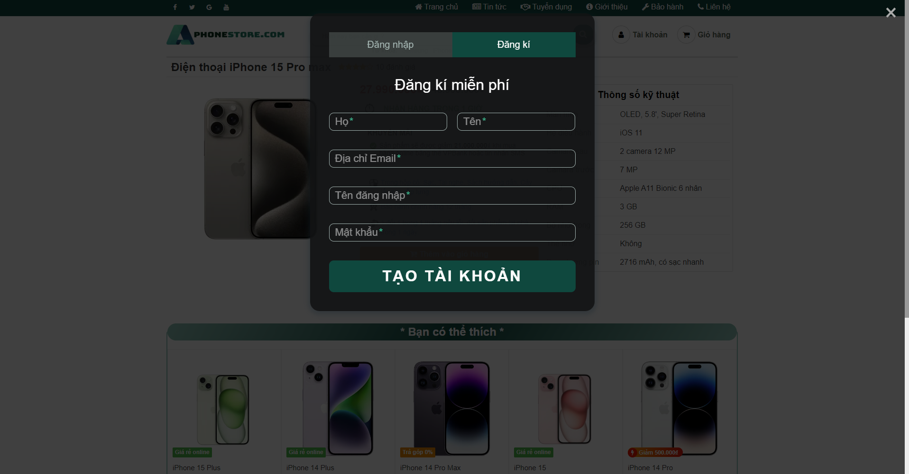
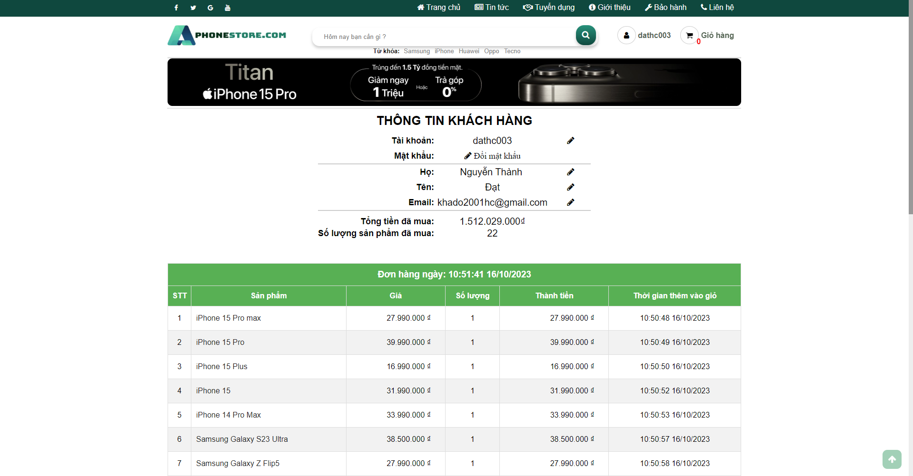
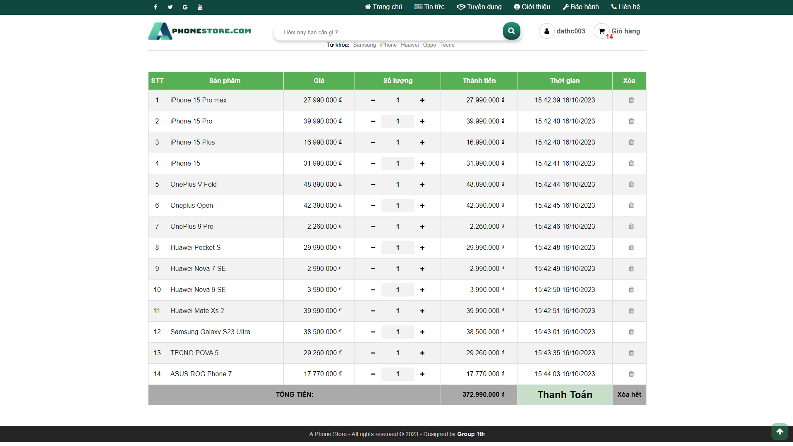
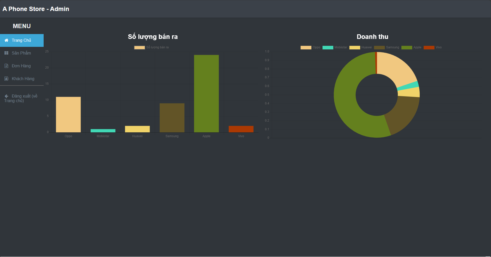
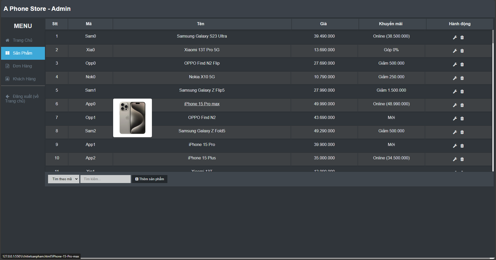
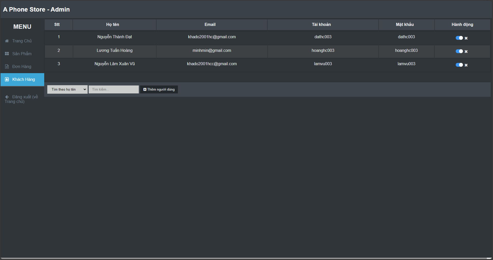

# DoAn_Web

Đồ án môn web , web tĩnh, đề tài trang web bán điện thoại.

Giao diện thân thiện, dễ sử dụng, chức năng khá đầy đủ.

Chức năng **Cơ bản**:

- Trang chủ hiển thị đẹp, các sản phẩm được chia theo nhiều tiêu chí: nổi bật, mới, khuyến mãi, giá rẻ, .. 
- Tìm kiếm/lọc/sắp xếp sản phẩm theo hãng, giá, tên, khuyến mãi, đánh giá, số sao, ...
- Đăng ký, đăng nhập, giỏ hàng, trang người dùng, lịch sử mua hàng.
- Trang chi tiết sản phẩm, giao diện **gợi ý sản phẩm** tương tự.

Chức năng **ADMIN**:

- **Thống kê** số lượng bán ra, doanh thu của từng hãng
- Danh sách **sản phẩm**, tìm kiếm/lọc, thêm/sửa/xoá sản phẩm
- Danh sách **đơn hàng**, tìm kiếm/lọc, duyệt/huỷ đơn hàng
- Danh sách **khách hàng**, tìm kiếm/lọc, thêm/xoá/khoá khác hàng

## Admin Account: 
+ username: Admin
+ password: Admin

## Screenshots
Sử dụng XAMPP để kết nối database qua SQL và cấu hình máy chủ Apache, phục vụ chạy thử web trên máy chủ local

XAMPP là một bộ công cụ phát triển ứng dụng web mã nguồn mở được sử dụng phổ biến để tạo môi trường phát triển web cục bộ trên máy tính cá nhân. Bạn có thể sử dụng XAMPP để cài đặt và chạy máy chủ web Apache, cơ sở dữ liệu MySQL và phiên bản PHP trên máy tính của mình để phát triển và thử nghiệm các ứng dụng web.

Tải XAMPP: Truy cập vào trang web chính thức của XAMPP (https://www.apachefriends.org/) và tải phiên bản XAMPP phù hợp với hệ điều hành của bạn.

Cài đặt XAMPP: Chạy tệp tin cài đặt và làm theo các bước hướng dẫn trên màn hình để cài đặt XAMPP. Bạn có thể chọn cài đặt các thành phần như Apache, MySQL, PHP và phpMyAdmin.

Khởi động XAMPP: Sau khi cài đặt hoàn tất, khởi động XAMPP bằng cách chạy ứng dụng XAMPP Control Panel.

Sử dụng XAMPP Khởi động máy chủ web Apache: Trong XAMPP Control Panel, nhấp vào nút "Start" (hoặc "Start" bên cạnh dòng "Apache"). Nếu Apache đã chạy thành công, bạn sẽ thấy thông báo "Running" hoặc "Started" ở phần Apache.

Khởi động cơ sở dữ liệu MySQL: Trong XAMPP Control Panel, nhấp vào nút "Start" (hoặc "Start" bên cạnh dòng "MySQL"). Nếu MySQL đã chạy thành công, bạn sẽ thấy thông báo "Running" hoặc "Started" ở phần MySQL.

Đặt tệp tin PHP vào thư mục htdocs: Mở thư mục cài đặt XAMPP trên máy tính của bạn và tìm thư mục "htdocs". Đây là nơi bạn sẽ đặt các tệp tin PHP và tài nguyên web của mình. Sao chép tệp tin PHP đã tải lên vào thư mục "htdocs".

Truy cập ứng dụng web: Mở trình duyệt web và nhập địa chỉ "http://localhost/nametruongthumuc" (với "nametruongthumuc" là tên thư mục chứa tệp tin PHP của bạn trong thư mục "htdocs"). Bạn sẽ thấy ứng dụng web được chạy trên máy chủ web cục bộ của XAMPP.

Quản lý cơ sở dữ liệu: Để quản lý cơ sở dữ liệu MySQL, bạn có thể truy cập vào trang phpMyAdmin bằng cách nhập địa chỉ "http://localhost/phpmyadmin" vào trình duyệt web. Từ đây, bạn có thể tạo và quản lý các cơ sở dữ liệu của mình.

Dừng XAMPP: Khi bạn đã hoàn thành công việc phát triển và thử nghiệm ứng dụng web, bạn có thể dừng XAMPP bằng cách nhấp vào nút "Stop" (hoặc "Stop" bên cạnh dòng "Apache" và "MySQL") trong XAMPP Control Panel.

Lưu ý Đảm bảo rằng XAMPP đang chạy khi bạn muốn phát triển hoặc chạy các ứng dụng web cục bộ trên máy tính của mình. Hãy cẩn thận khi làm việc với các tệp tin và cơ sở dữ liệu trong XAMPP, đặc biệt là trên môi trường phát triển và không được sử dụng cho môi trường sản xuất. Xem configure trong SQL của Xampp có giống với phần db_connection.php không để điều chỉnh lại
### Cơ bản

<!-- Trang chủ

Sản phẩm trong trang chủ

Chi tiết sản phẩm

Đăng nhập

Đăng ký

Trang người dùng

Giỏ hàng

Tìm kiếm/lọc/sắp xếp sản phẩm

### Admin

Admin: Thống kê

Admin: Sản phẩm

Admin: Đơn hàng

Admin: Người dùng
 -->
